# Laporan Praktikum Modul 1

### Anggota  Kelompok D15 :

### Richard Asmarakandi (05111940000017)

### Nurul Izzatil Ulum (05111940000058)

## SOAL

#### 1. Sebutkan webserver yang digunakan pada "ichimarumaru.tech"!

Ketika kita membuka website "ichimarumaru.tech", kita akan disuguhkan dengan halaman yang menunjukkan bahwa website menggunakan webserver nginx.

Untuk memastikan, dapat dilakukan pada wireshark, lalu menggunakan display filter `http contains nginx`. dan terlihat, server menggunakan nginx.

#### 2. Temukan paket dari web-web yang menggunakan basic authentication method!

Karena yang dicari adalah paket maka isi display filter adalah `http.authbasic`

#### 3. Ikuti perintah di basic.ichimarumaru.tech! Username dan password bisa didapatkandari file .pcapng!

Pertama, isi display filter dengan `http.host contains basic.ichimarumaru.tech` > klik paket paling atas.

Kedua, cari `Hyper Text Protocol` > `Authorization` maka di Credentials ada username dan password yang dipakai

Ketiga, untuk mencopy password dan username tersebut, `klik kiri` > `Copy` > `Value` lalu Pastekan pada suatu media 

Terakhir, jika username dan password tadi dimasukkan, maka website `basic.ichimarumaru.tech` akan terbuka

#### 4. Temukan paket mysql yang mengandung perintah query select!

Mengisi display filter dengan `mysql contains select or mysql contains SELECT` karena ada select yang menggunakan kapital dan tidak.

#### 5. Login ke portal.ichimarumaru.tech kemudian ikuti perintahnya! Username dan password bisa didapat dari query insert pada table users dari file .pcap!

Karena diketahui username dan password dapat diperoleh melalui query insert, maka kita mencari paket mysql yang mengandung query dengan perintah insert melalui display picture. Expresionnya adalah `mysql.query contains INSERT or mysql.query contains insert`. Maka akan didapatkan hasil sebagai berikut :
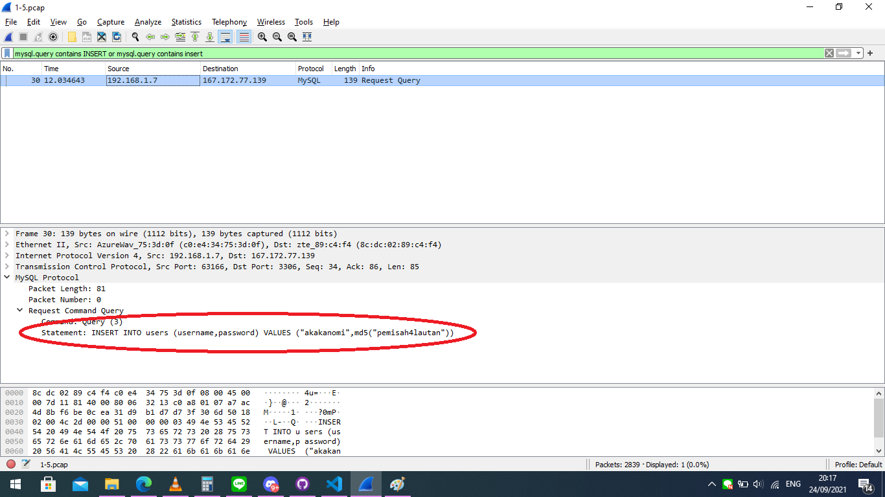

Dari hasil tersebut, dapat disimpulkan bahwa usernamenya "akakanomi" dan passwordnya "pemisah4lautan". Setelah mendapatkan username dan password, kita loginkan pada http://portal.ichimarumaru.tech. Maka akan tampil halaman web seperti berikut :
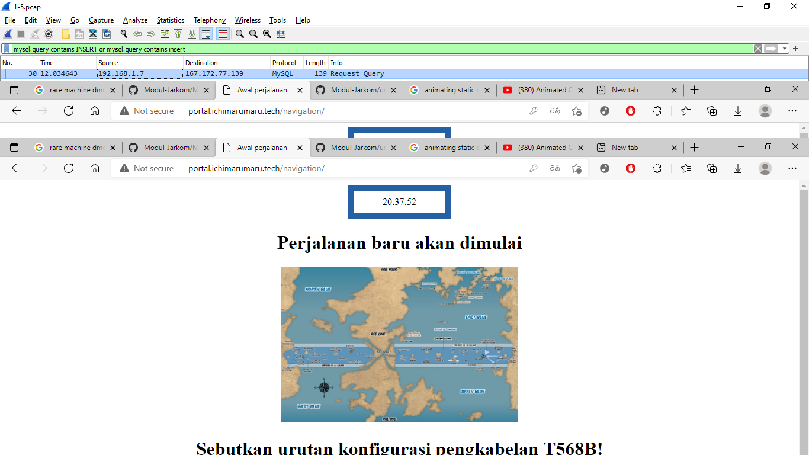

Terdapat pertanyaan pada halaman tersebut dan kita diharuskan menjawab pertanyaannya, maka kita hanya perlu mengisi kolom jawaban dengan jawaban yang benar
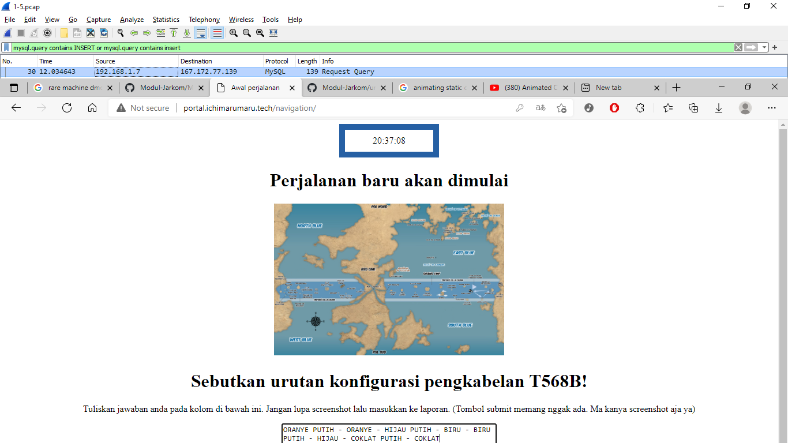

#### 6. Cari username dan password ketika melakukan login ke FTP Server!

Mengisi display filter dengan `ftp.request.command == "USER" || ftp.request.command == "PASS"`

#### 7. Ada 500 file zip yang disimpan ke FTP Server dengan nama 0.zip, 1.zip, 2.zip, ..., 499.zip. Simpan dan Buka file pdf tersebut. (Hint = nama pdf-nya "Real.pdf")

Pertama tulis di display filter `ftp-data contains "Real.pdf"`

Setelah itu, `klik kiri` pada paket yang paling atas > `follow` > `TCP Stream`

Setelah keluar, ganti `Show as` dengan `Raw` lalu simpan data dalam bentuk `.zip`

Setelah tersimpan, ekstrak file dan buka pdf, maka akan muncul gambar seperti ini

#### 8. Cari paket yang menunjukan pengambilan file dari FTP tersebut!

Isi pada Display Filter `ftp contains RETR`. RETR sendiri digunakan untuk men-download suatu file dari FTP server, jadi untuk melihat adanya pengambilan file atau tidak maka bisa dengan mencari RETR-nya

#### 9. Dari paket-paket yang menuju FTP terdapat indikasi penyimpanan beberapa file. Salah satunya adalah sebuah file berisi data rahasia dengan nama "secret.zip". Simpan dan buka file tersebut!

Untuk mencari file bernama secret.zip, maka kita coba mencari menggunakan display filter `ftp-data.command contains secret.zip`. Lebih jelasnya, karena kita akan menyimpan sebuah paket yang merupakan sebuah **file** yang bernama `secret.zip` dari ftp, kita gunakan ftp-data dan kita spesifikan pencarian pada `ftp-data.command` karena kita, dapat menemukan paket saat file secret.zip tersebut diunggah pada ftp (dengan command `STOR`). Maka akan muncul tampilan seperti berikut :

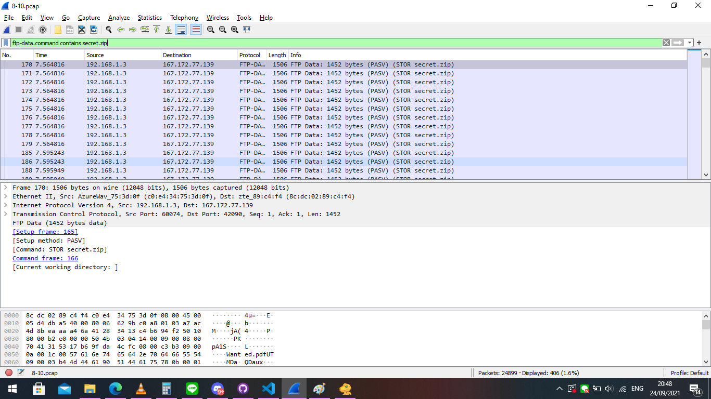

Selanjutnya, untuk mendapatkan paket, kita klik kanan pada paket yang akan disimpan/diunduh, lalu menggunakan perintah follow -> TCP Stream seperti pada gambar berikut :
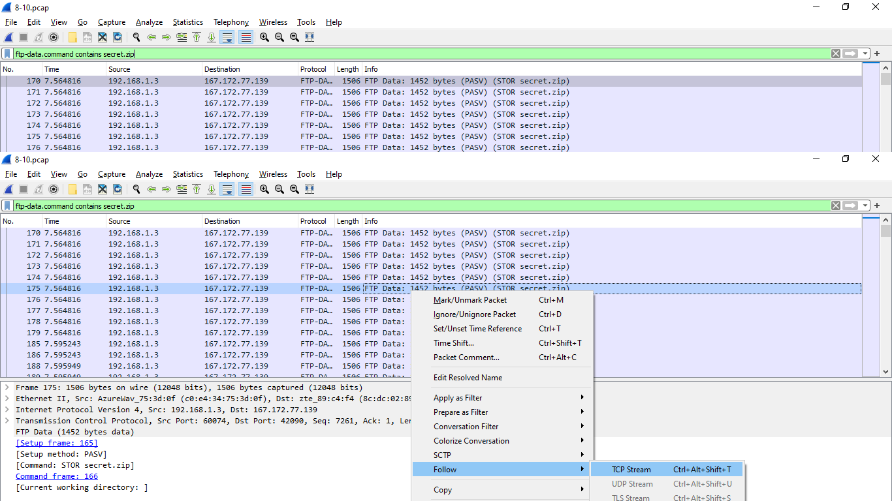

Setelah itu akan muncul tampilan seperti berikut :
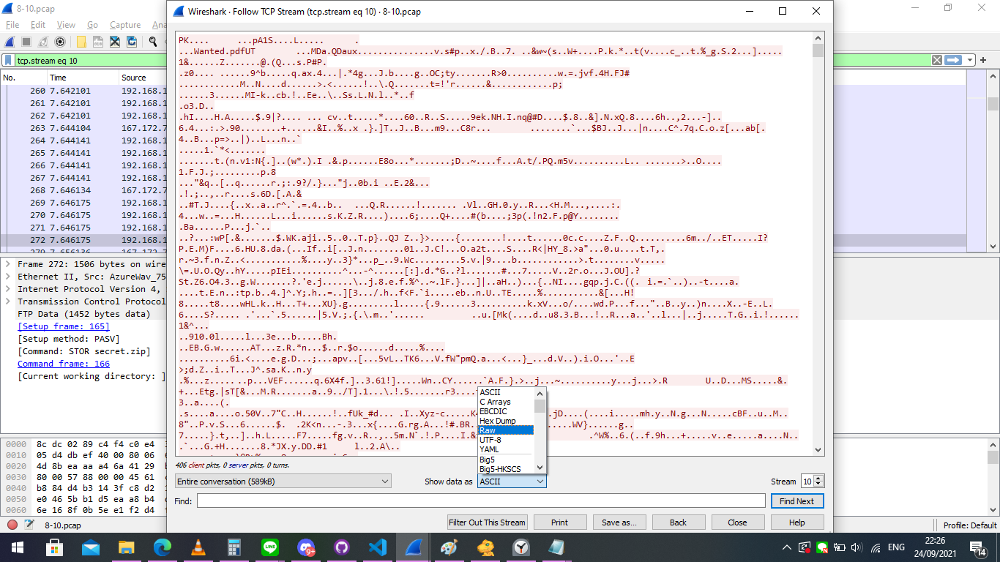

Kita ubah `Show data as` menjadi `Raw`, lalu klik save as, dan pilih direktori tempat kita menyimpan file/paket yang akan diunduh. Ketika dibuka file memuat password. Kita masukkan password yang kita temukan pada no 10, yaitu `d1b1langbukanapaapajugagapercaya` :
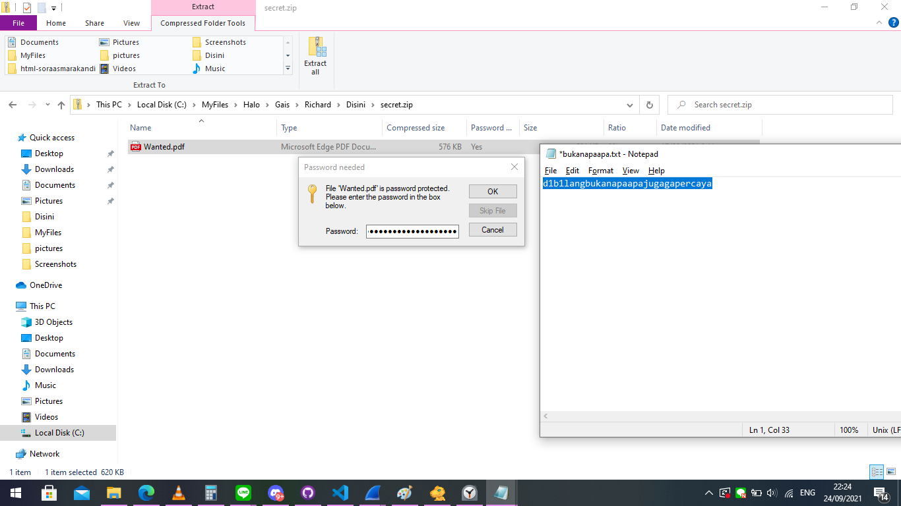

Maka akan terbuka file `Wanted.pdf`-nya :

#### 10.Selain itu terdapat "history.txt" yang kemungkinan berisi history bash server tersebut! Gunakan isi dari "history.txt" untuk menemukan password untuk membuka file rahasia yang ada di "secret.zip"!

Untuk mencari file history.txt, kita gunakan display filter `ftp-data.command contains history.txt`. Penjelasannya sama dengan no 9, mengapa kita menggunakan display filter dengan expression tersebut. Maka akan muncul tampilan seperti berikut :
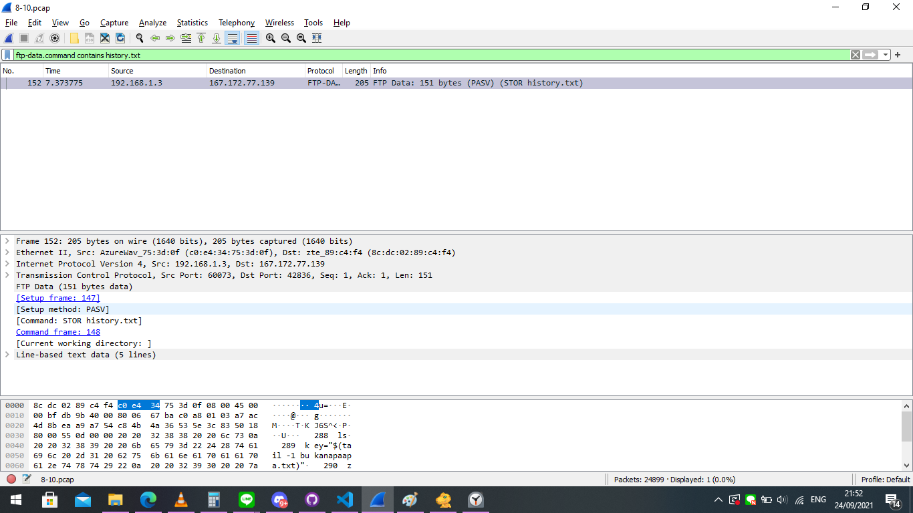

Berikutnya seperti tadi, kita simpan/unduh file dari paket tersebut dengan menggunakan follow -> TCP Stream, sama persis caranya dengan no 9. Ketika dibuka, file akan terlihat seperti ini :
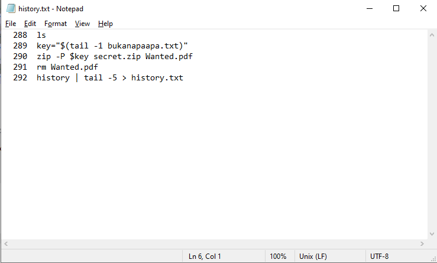

Jika kita lihat, text tersebut mirip dengan perintah pada terminal linux. Perintah tersebut digunakan untuk melakukan `zip` pada file Wanted.pdf dan `zip` tersebut diberi nama `secret.zip`. Disinilah kita dapat menemukan kunci untuk membuka `secret.zip`. Karena pada perintah tersebut dituliskan `zip -P $key secret.zip Wanted.pdf`, dan `key = "$(tail -1 bukanapaapa.txt)"`, maka pasti password dari file `secret.zip` berkaitan dengan file bernama `bukanapaapa.txt`. Maka kita cari lagi file bernama `bukanapaapa.txt` pada wireshark dengan display filter menggunakan expression `ftp-data.command contains bukanapaapa.txt`. Hasilnya akan tampil seperti berikut :
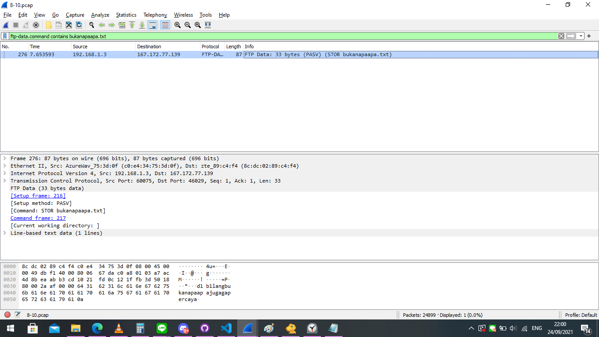

Maka ditemukan file `bukanapaapa.txt`. Seperti tadi, kita lakukan export/unduh file dari paket tersebut menggunakan follow->TCP Stream. Ketika di buka file akan terlihat seperti ini :
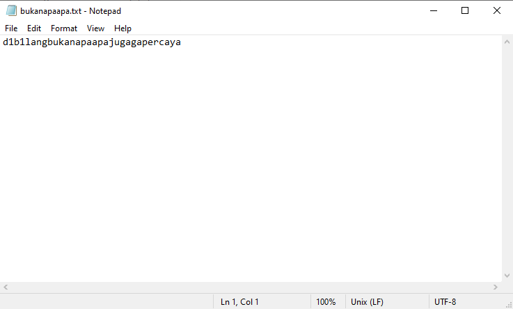

Kemungkinan itulah passwordnya, yaitu `d1b1langbukanapaapajugagapercaya`. dan setelah dimasukkan ternyata berhasil. Untuk buktinya, ditunjukkan pada no 9.

#### 11. Filter sehingga wireshark hanya mengambil paket yang berasal dari port 80!

Karena perintah yang diberikan adalah `mengambil` maka kita memakai capture filter. Lalu menangkap paket yang berasal dari port 80 sehingga dihasilkan expression `src port 80`. src menandakan bahwa wireshark hanya akan menangkap paket yang `berasal`, lalu `port 80` sehingga menangkap paket yang berasal dari port 80.
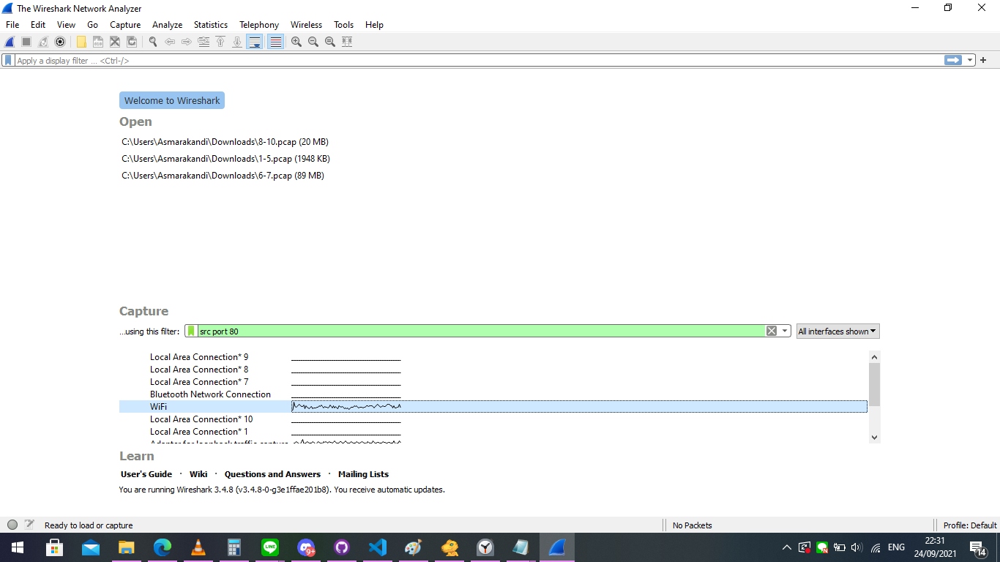

Hasilnya :
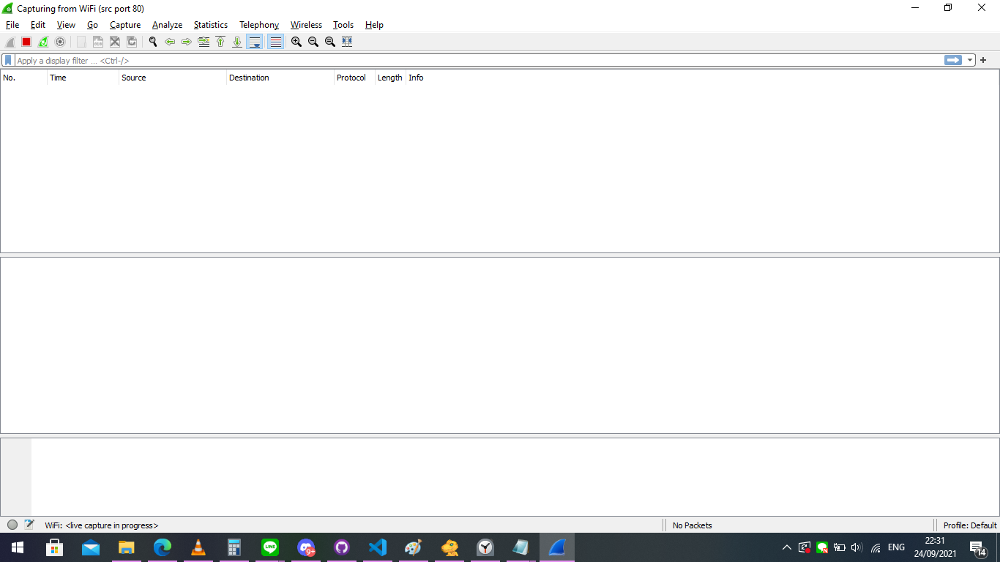

#### 12. Filter sehingga wireshark hanya mengambil paket yang mengandung port 21!

Hampir sama dengan no 11, namun disini `mengandung` sehingga entah itu `berasal` ataupun `menuju`, keduanya harus dapat ditangkap oleh wireshark, sehingga kita hanya perlu menuliskan expression pada capture filter `port 21`
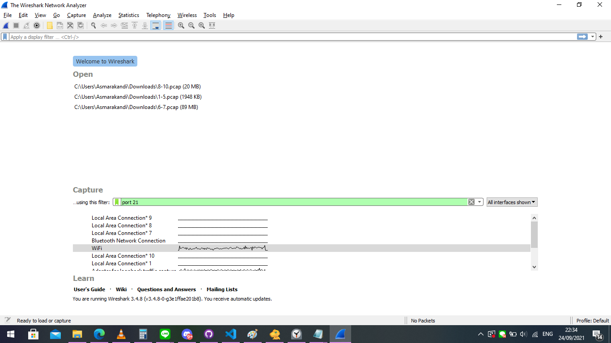

Hasilnya :
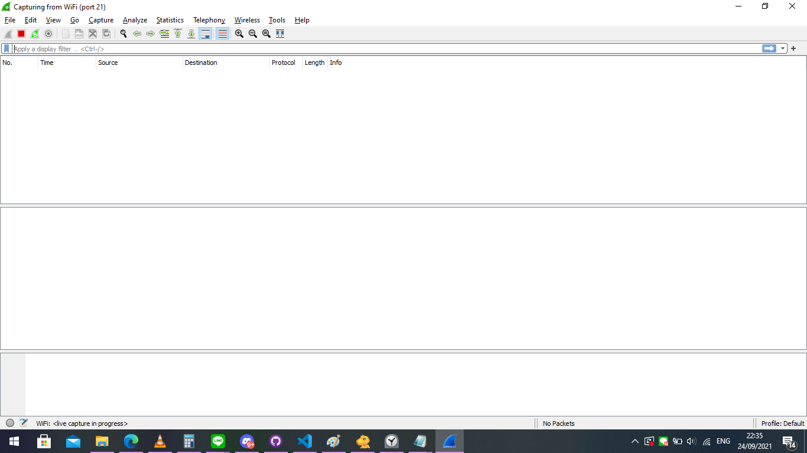

#### 13. Filter sehingga wireshark hanya menampilkan paket yang menuju port 443!

Untuk menampilkan, maka filter yang perlu diisi adalah Display Filter. Display filter bisa diisi dengan `tcp.port == 443`

#### 14. Filter sehingga wireshark hanya mengambil paket yang tujuannya ke kemenag.go.id!

Karena perintah yang diberikan adalah `mengambil` maka yang diisi adalah Capture Filter. Capture Filter dapat diisi `dst host kemenag.go.id`.

Maka ketika dijalankan, saat kita tidak membuka website `kemenag.go.id` maka tidak akan ada paket yang masuk. paket baru masuk saat kita membuka website tersebut.

#### 15. Filter sehingga wireshark hanya mengambil paket yang berasal dari ip kalian!

Sebelumnya kita harus mengetahui IP Address kita terlebih dahulu. Cara mengetahuinya adalah dengan mengetikkan `ipconfig` pada command prompt. Lalu kita cari sambungan yang mengarah ke internet yang kita gunakan, dan temukan IPv4 Addressnya.
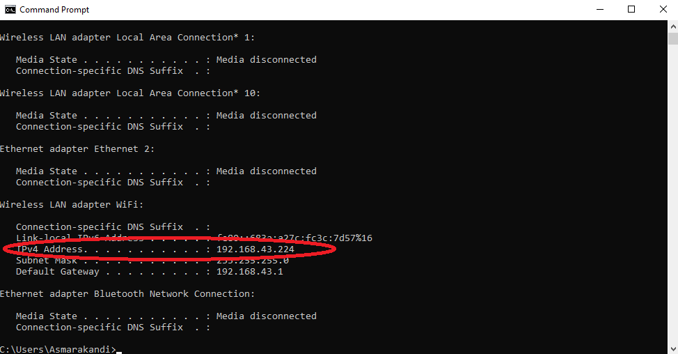

Pada gambar tersebut, diketahui IP Address yang saya gunakan adalah `192.168.43.224`. Maka kita gunakan IP yang telah kita temukan tersebut pada capture filter, karena perintah pada soal adalah `mengambil`. Lalu karena paket yang ingin ditangkap adalah `berasal`, maka digunakan expression `src`. Sehingga terbentuklah expression `src 192.168.43.224`.
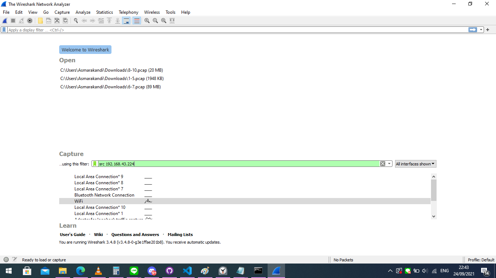

Hasilnya :
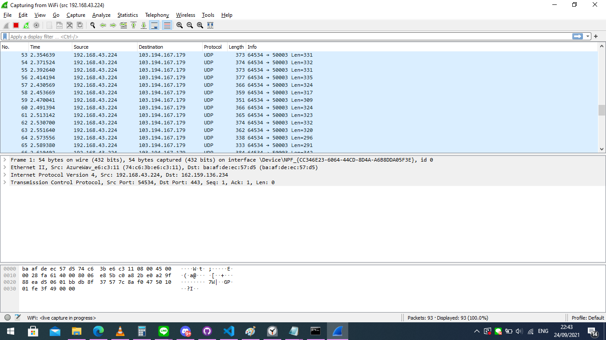

## Masalah saat mengerjakan

Ada :

1. Pada nomor 7, Awal waktu file akhir disimpan dalam bentuk `.pdf`, ketika pdf-nya dibuka, gambar tidak keluar. Setelah itu dicoba menyimpan file dalam bentuk `.zip` baru kemudian di ekstrak. dan setelah itu pdf terbuka tanpa ada masalah.

2. Pada saat export file, terutama dalam bentuk `.zip` seringkali terjadi  file. Ternyata, export harus dilakukan secara perlahan hingga file benar-benar tampil secara sempurna dan bisa di export menjadi `.zip` yang openable
